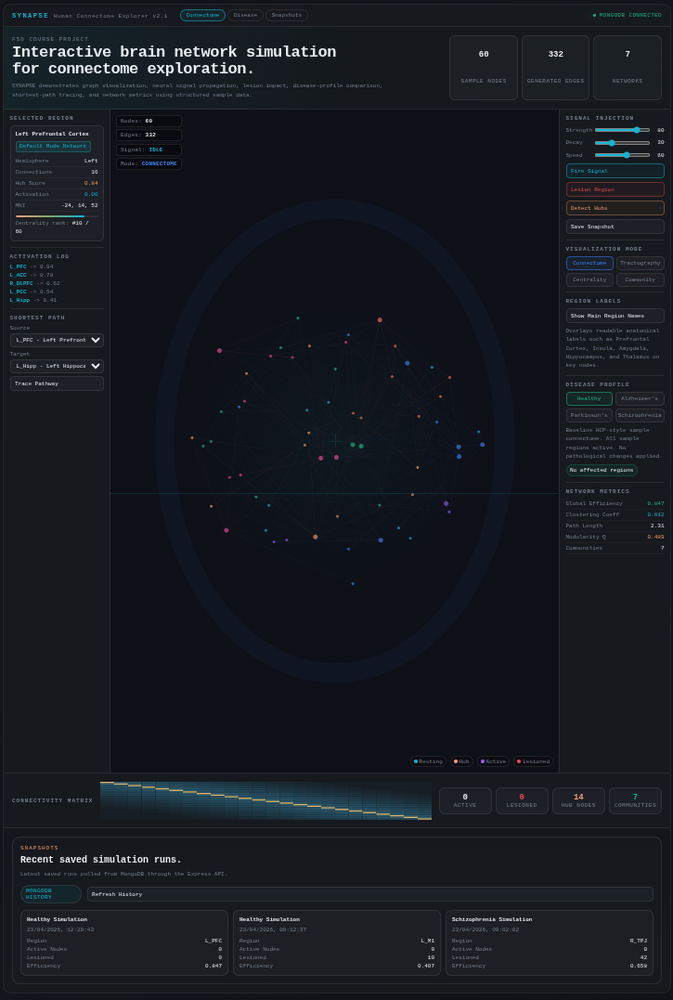
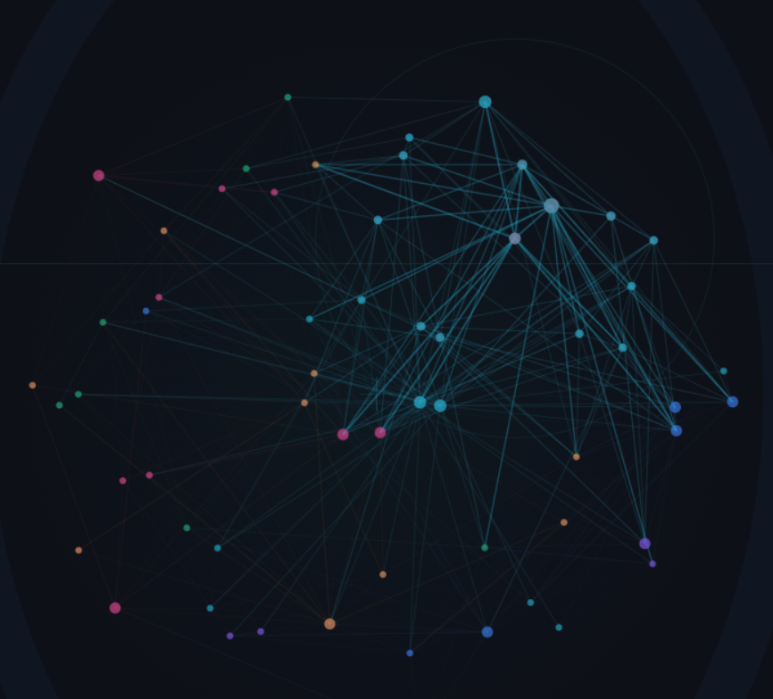

# SYNAPSE

SYNAPSE is an FSD course-based project that simulates a human connectome explorer with a browser UI, sample neurological disease profiles, pathway tracing, lesion experiments, and MongoDB-backed snapshot history.

It is intentionally built around structured sample data rather than clinical data, but the UI and behavior are designed to make condition switching, configuration history, and network-state changes feel believable enough for demos and presentations.

## Features

- Multi-view interface with `Explorer`, `Overview`, `Disease Lab`, and `History` sections
- Interactive connectome canvas with node selection, signal firing, lesions, labels, and mode switching
- Disease profiles for `Healthy`, `Alzheimer's`, `Parkinson's`, and `Schizophrenia`
- Disease-specific pathway presets and visual/network differences
- Compare-with-healthy panel for key network metrics
- MongoDB-backed simulation snapshot history with restorable saved configs
- Express API for bootstrap data and snapshot persistence

## Screenshots





## Tech Stack

- Frontend: HTML, CSS, vanilla JavaScript, Canvas
- Backend: Node.js, Express
- Database: MongoDB
- Tooling: Webpack

## Project Structure

```text
.
├── css/                  # Main styling
├── js/                   # Frontend app, data, renderer, model
├── server/               # Express server, DB connection, seed logic
├── report_assets/        # Screenshots used in the report / README
├── presentation/         # Project presentation
├── scripts/              # Utility scripts
├── index.html            # Main app entry
└── package.json          # Scripts and dependencies
```

## Getting Started

### 1. Install dependencies

```bash
npm install
```

### 2. Configure environment

Copy `.env.example` to `.env` if you want to override defaults.

```env
PORT=3000
MONGODB_URI=mongodb://127.0.0.1:27017
MONGODB_DB=synapse
```

### 3. Run with MongoDB-backed history

Start MongoDB in one terminal:

```bash
npm run mongo
```

Start the app server in another terminal:

```bash
npm start
```

Then open:

```text
http://localhost:3000
```

### 4. Optional: reseed the database

```bash
npm run seed
```

### 5. Optional: frontend dev server

```bash
npm run frontend
```

### 6. Production build

```bash
npm run build
```

## Available Scripts

- `npm start` - start the Express server
- `npm run mongo` - run MongoDB locally using `./mongo-data`
- `npm run seed` - reseed bootstrap collections
- `npm run frontend` - run the Webpack dev server
- `npm run build` - create a production build in `dist/`

## Notes

- If the app is opened directly as a file or the backend is unavailable, it falls back to local sample data.
- Snapshot restore works best for runs saved after the full config-history feature was added.
- The disease and metric data are simulated for project/demo purposes.

## License

This project is released under the terms of the [MIT License](LICENSE.txt).
